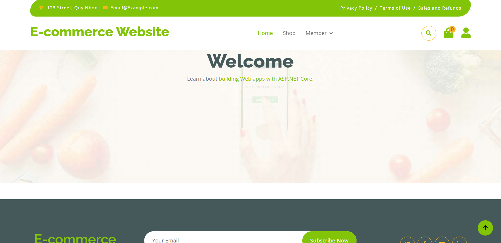
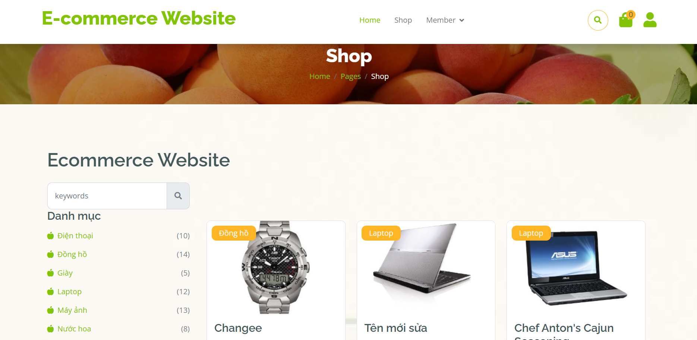
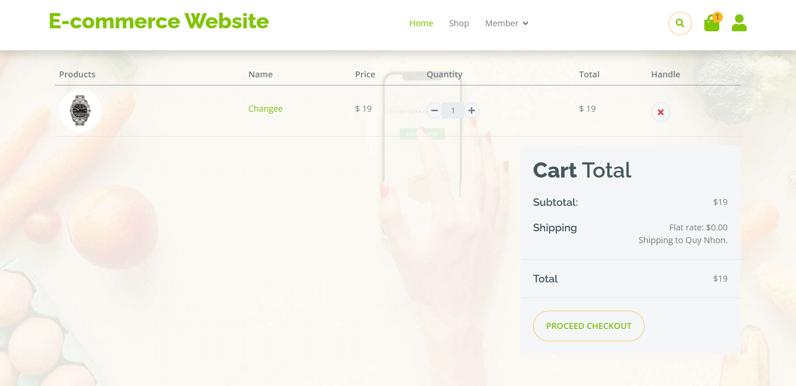
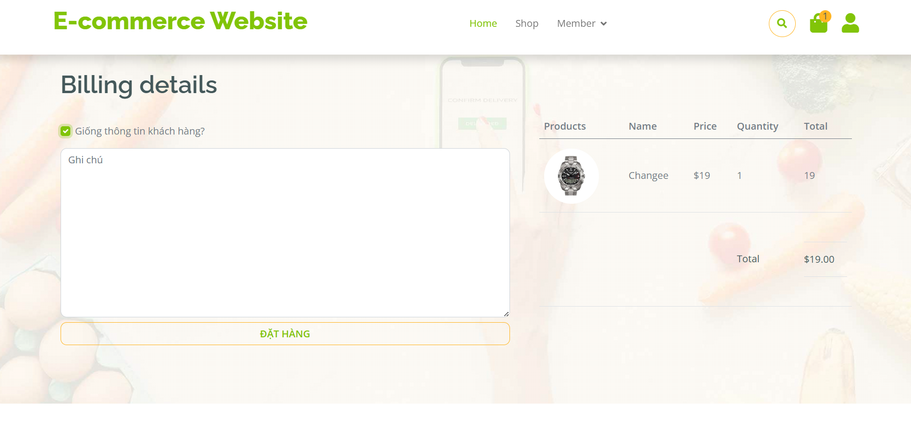

# E-commerce Website - ASP.NET

This project is an e-commerce web application built with **ASP.NET**. It provides a platform where users can browse products, add them to the cart, and proceed with the checkout process. The application supports user authentication, product management, and order tracking, offering an intuitive and secure shopping experience.

## Features
- **User Authentication**: Users can register, log in, and manage their accounts.
- **Product Catalog**: Display products with details like price, description, and images.
- **Shopping Cart**: Add, update, and remove products from the shopping cart.
- **Order Management**: Users can place orders, view order history, and track their status.
- **Admin Panel**: Admins can manage product listings, view customer orders, and handle inventory.

## Technologies Used
- **ASP.NET**: Framework for building the web application and handling server-side logic.
- **Entity Framework**: ORM tool for interacting with the database.
- **SQL Server**: Used for storing user, product, and order data.
- **HTML/CSS/JavaScript**: For building the frontend and ensuring a responsive UI.
- **Bootstrap**: For styling the web pages and making the layout responsive.

## Screenshots

### Home Page


### Product Page


### Shopping Cart


### Checkout Page


## Setup Instructions
To run this project locally, follow these steps:

1. Clone this repository:
   ```bash
   git clone https://github.com/DoanVyVy/Ecommerce_web_ASP.NET.git
   cd Ecommerce_web_ASP.NET
